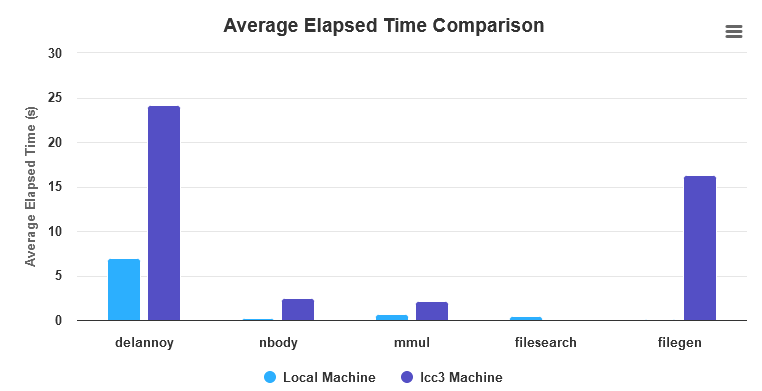

```
CPU: 12-core 13th Gen Intel Core i7-13700KF (-MT MCP-) speed: 3418 MHz
Kernel: 5.15.133.1-microsoft-standard-WSL2 x86_64 Up: 19m
Mem: 2026.2/15911.5 MiB (12.7%) Storage: 1 TiB (83.2% used) Procs: 26
Shell: Bash inxi: 3.3.13
```

### Exercise 1

delannoy.c is a program that calculates the Delannoy number, which represents the number of paths from (0,0) to (m,n) in a grid, only moving right, up, or diagonally right and up.

```
/bin/time ./delannoy 15
Verification: OK
33.05user 0.00system 0:33.05elapsed 100%CPU (0avgtext+0avgdata 1488maxresident)k
0inputs+0outputs (0major+68minor)pagefaults 0swaps
```

nbody.c is a program that simulates the gravitational forces between a collection of celestial bodies, updating their positions and velocities over time.

```
/bin/time ./nbody
Verification: OK
0.27user 0.00system 0:00.27elapsed 100%CPU (0avgtext+0avgdata 1892maxresident)k
0inputs+0outputs (0major+99minor)pagefaults 0swaps
```

MMult is a program that multiplies two matrices of size `n`x`n`. 

```
/bin/time ./mmul 
Verification: OK
0.68user 0.00system 0:00.68elapsed 99%CPU (0avgtext+0avgdata 24448maxresident)k
0inputs+0outputs (0major+1336minor)pagefaults 0swaps
```

filesearch is a program that searches the largest file in the current directory.

```
/bin/time ./filesearch
The largest file is ./CMakeFiles/CMakeOutput.log with size 45224 bytes
0.00user 0.00system 0:00.00elapsed 86%CPU (0avgtext+0avgdata 1608maxresident)k
0inputs+0outputs (0major+75minor)pagefaults 0swaps
```

filegen.c is a program that generates a specified number of directories and files, with each file's size randomly determined within a given minimum and maximum range, using a provided seed for the random number generator.

```
 /bin/time ./filegen 1000 1000 5000 7000 1
61.04user 15.57system 1:16.65elapsed 99%CPU (0avgtext+0avgdata 1632maxresident)k
0inputs+16000000outputs (0major+74minor)pagefaults 0swaps
```

### Exercise 2

For the automated experiment setup I used python `script.py`. The script calculates the mean time of execution for each program and the standard deviation. The script also generates .csv file with the results.

For builing the programs I didn't used Ninja as generator but "Unix Makefiles" instead and than I used `make` command to build the programs.

The results on my local machine are:

```
Benchmark,Avg Elapsed Time (s),Avg User Time (s),Avg System Time (s),Var Elapsed Time (s^2),Var User Time (s^2),Var System Time (s^2)
delannoy,6.94,6.986,0.0,0.002999999999999979,0.001180000000000004,0.0
nbody,0.2,0.272,0.0,0.0,2.0000000000000036e-05,0.0
mmul,0.6599999999999999,0.694,0.0,0.0029999999999999988,8.000000000000014e-05,0.0
filesearch,0.5,0.07200000000000001,0.448,0.0,0.0009700000000000002,0.00041999999999999953
filegen,0.1,0.062,0.104,0.0,0.00036999999999999994,0.0003800000000000001
```

On the lcc3 machine the results are:

```
Benchmark,Avg Elapsed Time (s),Avg User Time (s),Avg System Time (s),Var Elapsed Time (s^2),Var User Time (s^2),Var System Time (s^2)
delannoy,24.16,24.186,0.0,0.007999999999999943,0.007230000000000033,0.0
nbody,2.5,2.582,0.0,0.0,6.999999999999968e-05,0.0
mmul,2.1,2.126,0.0,0.014999999999999982,0.008530000000000008,0.0
filesearch,0.0,0.0,0.0,0.0,0.0,0.0
filegen,16.34,0.256,1.342,2.8429999999999995,0.0008300000000000008,0.018770000000000005
```



Note that I had also to make the filegen parameters smaller else I get a error like segmentation fault `Command terminated by signal 11`. Maybe there are a lot of directories in lcc3.