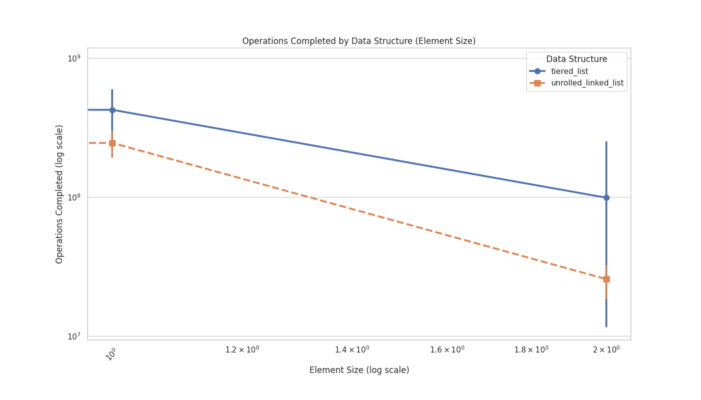
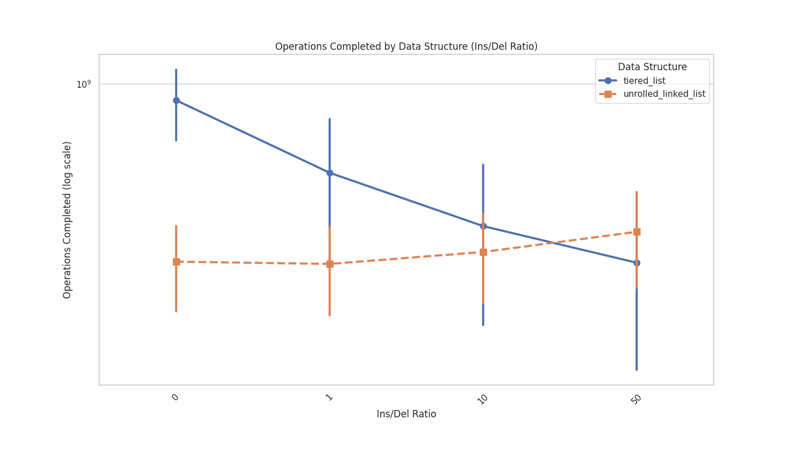
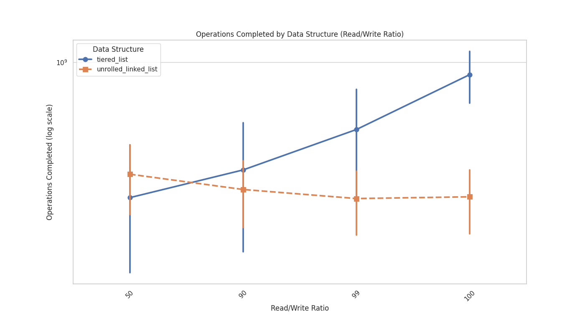
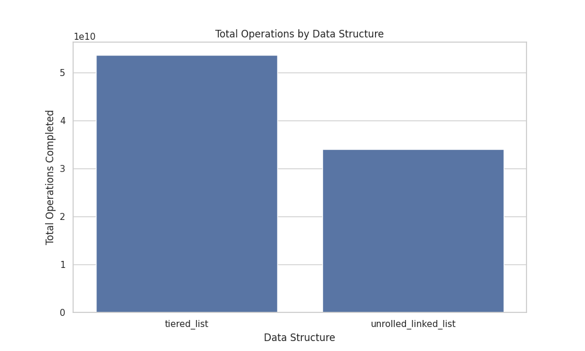
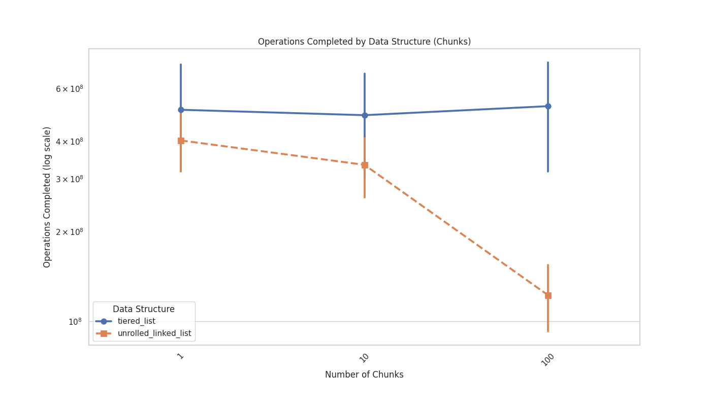

## Introduction

The decision array determines the sequence of operations for benchmarking, ensuring a mix of read, write, insert, and delete operations according to specified ratios. The entire array structure is dynamically allocated and cleaned up after use to manage memory efficiently.

## Implementation of Unrolled Linked List

The unrolled linked list was implemented using a structure with linked blocks, where each block contains a fixed number of elements. Each block has a pointer to the next block, and within each block, elements are stored in an array-like structure for efficient access. Why array instead of arraylist?
The benchmark is done by inserting elements at different positions so it could create some index out of bounce erros on arraylists.
Therefore we use a fixed size array to avoid this problem.

```java
ArrayList<Integer> arraylist = new ArrayList<>();
arraylist.add(2, 5); // Insert 5 at index 2

System.out.println(arraylist); // Output: (empty list)
```

```java
int[] array = new int[3]; // Array with size 3 (indices 0, 1, 2)
array[2] = 5; // Assigning to index 2 (valid)

System.out.println(array[0]); // Output: 0 (default value for int)
System.out.println(array[1]); // Output: 0 (default value for int)
System.out.println(array[2]); // Output: 5 (default value for int)
```

The primary operations (read, write, insert, delete) traverse the list to find the correct block and then operate on the array within the block. Initialization allocates memory for the blocks and their elements, and a cleanup function frees all allocated memory.

## Implementation of tiered list

The tiered list was implemented using a tier-zero array, which is a collection of chunk arrays. Each chunk is initialized with a fixed number of elements, all set to zero initially. Key operations (insert, delete, read, write) are defined to manage the data within these chunks. Insert and delete operations handle dynamic resizing and element shifting within chunks.

## Benchmarking

The provided graphs show the performance of two data structures, the tiered list and the unrolled linked list, across various metrics. Here's a detailed comparison for each graphic:

1. **Element Size vs Operations Completed:**
   

   - The tiered list performs consistently well across different element sizes, maintaining a high number of operations completed. The performance slightly decreases as the element size increases, but remains robust overall.
   - The unrolled linked list shows a more significant decrease in performance as element size increases. It starts with fewer operations completed than the tiered list and the gap widens with larger element sizes.

2. **Insert/Delete Ratio vs Operations Completed:**
   

   - The tiered list starts with a high number of operations completed and shows a decreasing trend as the insert/delete ratio increases. The difference is quite large at lower ratios.
   - The unrolled linked list maintains a relatively constant number of operations completed across different insert/delete ratios, with a slight increase as the ratio becomes more write-heavy.

3. **Read/Write Ratio vs Operations Completed:**
   

   - The tiered list shows a steady increase in operations completed as the read/write ratio becomes more read-heavy. The performance improves significantly at higher read/write ratios.
   - The unrolled linked list has a fairly constant performance with slight variation, not showing significant improvement or decline with varying read/write ratios.

4. **Total Operations Completed by Data Structure:**
   Note: 1e10 on y-axis meaning billion operations.
   
   - The tiered list completes a significantly higher total number of operations compared to the unrolled linked list.
   - The unrolled linked list completes fewer total operations overall.
5. **Number of chunks**
   

- The tiered list is more or less constant in the number of operations completed as the number of chunks increases.
- The unrolled linked list shows a slight decrease towards 10 chunks and afterwards a strong decrease in operations completed.

Overall, the tiered list consistently outperforms the unrolled linked list across various metrics, particularly excelling in scenarios with larger element sizes, read-heavy workloads, and varied insert/delete ratios. The unrolled linked list shows more stable performance in terms of insert/delete ratios but does not match the tiered list's efficiency and total operations completed.

## Memorable mentions for LCC3

Unfortunately on lcc3 the script always got stuck:

Arguments: tiered\*list 1 1000 8 1 99
slurmstepd-n001: error: \*\*\* JOB 115104 ON n001 CANCELLED AT 2024-06-04T20:55:20 DUE TO TIME LIMIT \_\*\*
slurmstepd-n001: error: Detected 1 oom_kill event in StepId=115104.batch. Some of the step tasks have been OOM Killed.
