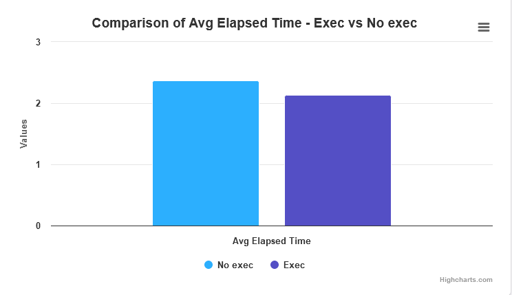
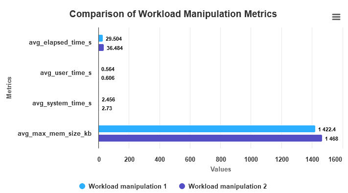

## Execercise 1

After spending over 8 hours attempting to slow down the program ./mmul using the script exec_with_workstation_heavy.sh, I wasn't able to observe a significant performance decrease.
I have done the followin steps:
* build the `load_generator` directory with cmake
* modified script.py to dynamically adjust the number of repetitions based on a specific confidence criteria.
* executed the following command (within the load_generator directory) in the job.sh file `chdir load_generator ./exec_with_workstation_heavy.sh "python3 -u /home/cb76/cb761222/perf-oriented-dev/sol/2/a/script.py"`

The program's performance remained relatively consistent despite adding more lines to exec_with_workstation_heavy.sh to theoretically increase the workload.

## Exercise 2 
I have build the C program with ` cmake` with the flag  `DCMAKE_BUILD_TYPE=Releaes`.
* The program generates a load by creating and deleting files.
* It takes three arguments: the number of files, iterations.
* In each iteration, it creates files with random names, writes random data and then deletes them.
* This repeats for the specified iterations with a delay between each iteration.
Running `filegen` in the `/tmp` directory resulted in segmentation faults `"Command terminated by signal 11"` likely due to insufficient memory. Lowering the program's arguments didn't resolve the issue as the base values `filegen 50 50 50 50 1` were already minimal.

To address the memory limitations, I tested filegen with slightly larger arguments `100 250 500 700 1` in the /scratch directory, followed by a complete deletion (rm -rf) to avoid filling the disk. 

While `filegen` appears to run slightly faster without the load generator, the difference isn't significant. The load generator was run with `load_generator` 1000000 1000000 but larger parameters could potentially reveal a more impactful difference. However, I opted not to use excessively large values to avoid overloading the /scratch directory.