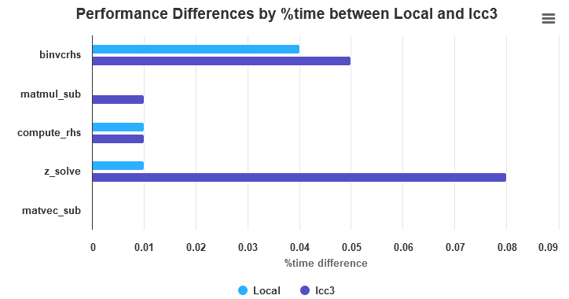
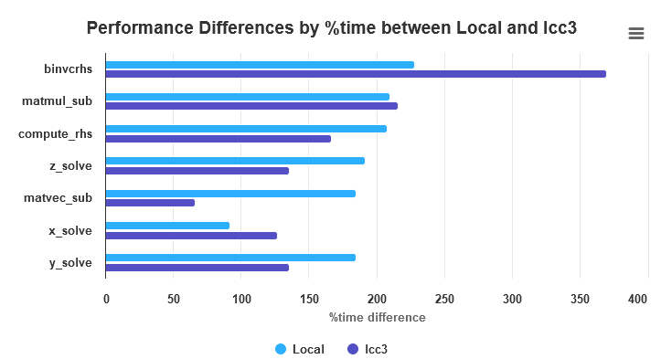

# Exercise 1
First of all we need to compile the binaries with the `-pg` flag to generate the profiling information.
I added in the `CMakeLists.txt` the following line to compile the binaries with the `-pg` flag and chose the `Debug` build type.

```cmake
set( CMAKE_C_FLAGS "${CMAKE_C_FLAGS} -pg")
set( CMAKE_CXX_FLAGS "${CMAKE_CXX_FLAGS} -pg")
set( CMAKE_EXE_LINKER_FLAGS "${CMAKE_EXE_LINKER_FLAGS} -pg")
set( CMAKE_SHARED_LINKER_FLAGS "${CMAKE_SHARED_LINKER_FLAGS} -pg")
```

./npb_bt* to execute the binaries so we can execute gprof on them.

```bash
gprof npb_bt_[X] gmon.out > [X].out
```

Where [X] is either `_s`, `_w`, `_a`, `_b` or `_c` depending on the binary to profile.	

### Metrics
1. % time spent in each function
2. cumulative time: means the time spent in the function and all functions called by it
3. self seconds: time spent in the function itself
4. calls: number of times the function was called
5. self ms/call: self seconds divided by the number of calls
6. total ms/call: cumulative time divided by the number of calls
7. name: name of the function

### _s local execution
```
Each sample counts as 0.01 seconds.
  %   cumulative   self              self     total           
 time   seconds   seconds    calls  ms/call  ms/call  name    
 40.00      0.04     0.04   201300     0.00     0.00  binvcrhs
 40.00      0.08     0.04       61     0.66     0.87  z_solve
 10.00      0.09     0.01       62     0.16     0.16  compute_rhs
 10.00      0.10     0.01       61     0.16     0.38  y_solve
  0.00      0.10     0.00   201300     0.00     0.00  matmul_sub
  0.00      0.10     0.00   201300     0.00     0.00  matvec_sub
  0.00      0.10     0.00    27792     0.00     0.00  exact_solution
  0.00      0.10     0.00    18300     0.00     0.00  binvrhs
  0.00      0.10     0.00    18300     0.00     0.00  lhsinit
  0.00      0.10     0.00       61     0.00     0.00  add
  0.00      0.10     0.00       61     0.00     1.64  adi
  0.00      0.10     0.00       61     0.00     0.22  x_solve
  0.00      0.10     0.00       22     0.00     0.00  timer_clear
  0.00      0.10     0.00        2     0.00     0.00  elapsed_time
  0.00      0.10     0.00        2     0.00     0.00  initialize
  0.00      0.10     0.00        2     0.00     0.00  wtime_
  0.00      0.10     0.00        1     0.00     0.00  error_norm
  0.00      0.10     0.00        1     0.00     0.00  exact_rhs
  0.00      0.10     0.00        1     0.00     0.00  print_results
  0.00      0.10     0.00        1     0.00     0.00  rhs_norm
  0.00      0.10     0.00        1     0.00     0.00  set_constants
  0.00      0.10     0.00        1     0.00     0.00  timer_read
  0.00      0.10     0.00        1     0.00     0.00  timer_start
  0.00      0.10     0.00        1     0.00     0.00  timer_stop
  0.00      0.10     0.00        1     0.00     0.16  verify

```
* Overall time: 0.10 (can see on the last row of the cumulative time)
* The most time-consuming function is `binvcrhs` with 40.00% of the total time.
* `z_solve` (40.00%) and `compute_rhs` (10.00%) are also impactful.
* less impactful functions were binvrhs, x_solve, adi...
    * also for printing results, initializing, etc.


### _c local execution
```
Each sample counts as 0.01 seconds.
  %   cumulative   self              self     total           
 time   seconds   seconds    calls   s/call   s/call  name    
 19.84    227.94   227.94 2485324800     0.00     0.00  binvcrhs
 18.29    437.97   210.03      201     1.04     1.61  z_solve
 18.11    645.94   207.97      202     1.03     1.03  compute_rhs
 16.70    837.81   191.87      201     0.95     1.52  y_solve
 16.08   1022.46   184.65      201     0.92     1.48  x_solve
  7.96   1113.86    91.40 2485324800     0.00     0.00  matmul_sub
  1.62   1132.45    18.59 2485324800     0.00     0.00  matvec_sub
  0.86   1142.34     9.89      201     0.05     0.05  add
  0.19   1144.55     2.21 15436800     0.00     0.00  lhsinit
  0.19   1146.70     2.16 68026392     0.00     0.00  exact_solution
  0.07   1147.53     0.82 15436800     0.00     0.00  binvrhs
  0.07   1148.34     0.81        1     0.81     1.21  exact_rhs
  0.02   1148.55     0.20        2     0.10     0.92  initialize
  0.00   1148.59     0.04        1     0.04     0.17  error_norm
  0.00   1148.62     0.03        1     0.03     0.03  rhs_norm
  0.00   1148.62     0.01        1     0.01     1.24  verify
  0.00   1148.62     0.00      201     0.00     5.69  adi
  0.00   1148.62     0.00       22     0.00     0.00  timer_clear
  0.00   1148.62     0.00        2     0.00     0.00  elapsed_time
  0.00   1148.62     0.00        2     0.00     0.00  wtime_
  0.00   1148.62     0.00        1     0.00     0.00  print_results
  0.00   1148.62     0.00        1     0.00     0.00  set_constants
  0.00   1148.62     0.00        1     0.00     0.00  timer_read
  0.00   1148.62     0.00        1     0.00     0.00  timer_start
  0.00   1148.62     0.00        1     0.00     0.00  timer_stop
  ```	

* Total execution time: 1148.62 seconds
* The function `binvcrhs` is the most time-consuming function with 19.84% of the total time. It seems that self s/call is also very very small.
* z_solve (18.29%): 201 calls, each taking 1.04 seconds on average.
* compute_rhs (18.11%): 202 calls, 1.03 seconds per call.
* less impactful matmul_sub (7.96%) and matvec_sub (1.62%).

### _s lcc3
```
Each sample counts as 0.01 seconds.
  %   cumulative   self              self     total           
 time   seconds   seconds    calls  us/call  us/call  name    
 62.51      0.05     0.05   201300     0.25     0.25  binvcrhs
 12.50      0.06     0.01   201300     0.05     0.05  matmul_sub
 12.50      0.07     0.01       62   161.31   161.31  compute_rhs
 12.50      0.08     0.01       61   163.96   491.87  z_solve
  0.00      0.08     0.00   201300     0.00     0.00  matvec_sub
  0.00      0.08     0.00    27792     0.00     0.00  exact_solution
  0.00      0.08     0.00    18300     0.00     0.00  binvrhs
  0.00      0.08     0.00    18300     0.00     0.00  lhsinit
  0.00      0.08     0.00       61     0.00   327.91  x_solve
  0.00      0.08     0.00       61     0.00   327.91  y_solve
  0.00      0.08     0.00        2     0.00     0.00  wtime_
  0.00      0.08     0.00        1     0.00     0.00  error_norm
  0.00      0.08     0.00        1     0.00     0.00  rhs_norm
```
* Total time is 0.08 seconds
* The most time-consuming function is `binvcrhs` with 62.51% of the total time.
* `matmul_sub` and `compute_rhs` are also impactful with 12.50% each.
* `z_solve` (12.50%) is also impactful.
* less impactful functions were binvrhs, x_solve, y_solve

### Difference between lcc3 and local execution
* We can see that the calls for all functions are the same, but the time spent in each function is different.
* The most time-consuming function is `binvcrhs` in both cases.
* `compute_rhs` is also impactful in both cases.
* `z_solve` is more impactful in the local execution.
* Strangly `matmul_sub` is more impactful in the lcc3 execution (12.50% time[lcc3] vs 0.00 time[locally]).
* `y_solve` in the local execution takes more 10% of the time, while in the lcc3 execution it takes 0.00% of the time.



### _c lcc3
```
Each sample counts as 0.01 seconds.
  %   cumulative   self              self     total           
 time   seconds   seconds    calls   s/call   s/call  name    
 29.11    369.75   369.75 2485324800     0.00     0.00  binvcrhs
 17.02    585.90   216.15 2485324800     0.00     0.00  matmul_sub
 13.70    759.91   174.01      201     0.87     1.95  z_solve
 13.12    926.58   166.66      201     0.83     1.92  y_solve
 10.66   1061.97   135.40      201     0.67     1.76  x_solve
  9.98   1188.67   126.70      202     0.63     0.63  compute_rhs
  5.20   1254.70    66.03 2485324800     0.00     0.00  matvec_sub
  0.69   1263.43     8.73                             add
  0.15   1265.37     1.94 15436800     0.00     0.00  lhsinit
  0.13   1267.06     1.69 68026392     0.00     0.00  exact_solution
  0.08   1268.13     1.07 15436800     0.00     0.00  binvrhs
  0.07   1269.02     0.89                             set_constants
  0.06   1269.79     0.77                             exact_rhs
  0.03   1270.11     0.32                             initialize
  0.00   1270.14     0.03        1     0.03     0.03  rhs_norm
  0.00   1270.16     0.02        1     0.02     0.13  error_norm
  0.00   1270.16     0.00        2     0.00     0.00  wtime_
```
* Total execution time: 1270.16 seconds
* The function `binvcrhs` is the most time-consuming function with 29.11% of the total time.
* `matmul_sub` (17.02%) and `z_solve` (13.70%) are also impactful.

### Difference between lcc3 and local execution
* We can see that the calls for all functions are the same, but the time spent in each function is different.
* The most time-consuming function is `binvcrhs` in both cases (29.11% vs 19.84%).
* `matmul_sub` is more impactful in the lcc3 execution (17.02% vs 7.96%).
* `z_solve` is more impactful in the local execution (17.02% vs 18.29%).



### Conclusion
* Why are the results in terms of time spent in each function different between the local and lcc3 execution?
    * Hardware differences (CPU, memory, etc.)
    *  system configurations
    *  other processes running on the system
* The most time-consuming functions are `binvcrhs`, `y_solve`, `compute_rhs`, `x_solve` and `z_solve`.
* In almost all cases `compute_rhs` & `binvcrhs` is taking most of the time.
* What are possible solutions?
    * Reducing the number of calls of binvcrhs and compute_rhs, especially in the _c case.
    * Algorithmic optimizations in the most time-consuming functions
    * Parallelization of the most time-consuming functions
    * Utilizing memoization, if binvcrhs executes redundant calculations
    * Reviewing the data structures
