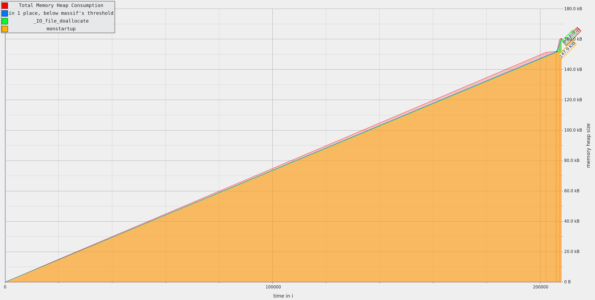
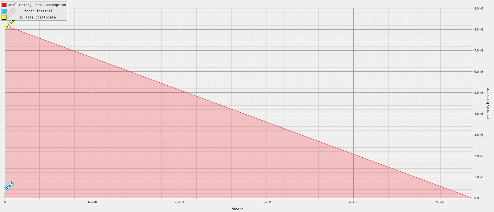

## Exercise 1

```
massif-visualizer [massif-data-file] => massif.out.%pid
```

As of right now in the 5 variant of the large C program the program with the lowest workload is the one that uses most memory heap with approx. 170 kB. The others are below 160 kb.

### a


### s


As for ssca2 


The program's memory usage starts at 8.5 MB of the heap. We firtsly generate "Scal Data" three times. It stabilizes for a while before experiencing a sudden peak to 25.69 MB for the betweennessCentrality() of function for all three generated sets. Then it followes a drop to 10 MB. Afterward, it fluctuates between around 8 to 25 MB Towards the end, it reaches another peak of 20.99 MB. In general the computeGraph() functions are stable as they need with time a little more memory. 


The perturbation in execution time caused by using Massif in this case is not significant but it can be potentially massive.