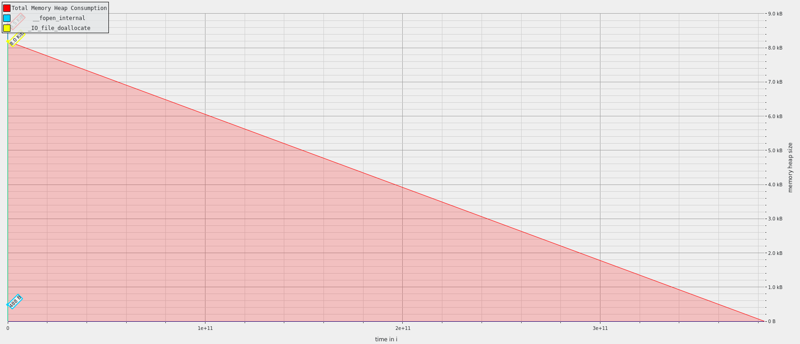

## Exercise 1

```
massif-visualizer [massif-data-file] => massif.out.%pid
```

As we can see both programs need to allocate more or less the same amount of memory eventho the workload is different

### a


### s


Runtime with massif
3.3s

Runtime without massif
0.3s

As for ssca2 


The program's memory usage starts at 8.5 MB of the heap. We firtsly generate "Scal Data" three times. It stabilizes for a while before experiencing a sudden peak to 25.69 MB for the betweennessCentrality() of function for all three generated sets. Then it followes a drop to 10 MB. Afterward, it fluctuates between around 8 to 25 MB Towards the end, it reaches another peak of 20.99 MB. In general the computeGraph() functions are stable as they need with time a little more memory. 


The perturbation in execution time caused by using Massif can be potentially massive.

Runtime with massif
1.25min

Runtime without massif
0.51s


## Exercise 2
L1-dcache-load-misses:u


### Time influence
npb_bt_a:

time with perf: 1:16.39
time without perf: 1:13.95

ssca2:
time with perf: 0:31.75
time without perf: 0:32.53