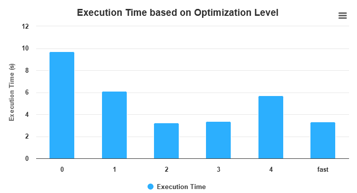

## Exercise 1

- **-O0**: Default optimization level; no optimization performed; code compiled quickly; used during development/debugging.
- **-O1**: Enables basic optimizations; includes simplifying code, eliminating unnecessary memory accesses, optimizing arithmetic operations; focuses on improving execution speed.
- **-O2**: More aggressive optimizations than -O1; enables loop unrolling, function inlining, instruction scheduling; significantly improves execution speed; may increase compilation time and code size.
- **-O3**: Even more aggressive optimizations than -O2; includes loop vectorization, interprocedural optimization, aggressive function inlining; further improves execution speed; may result in longer compilation times and larger code size.
- **-Os**: Optimizes code size rather than execution speed; reduces compiled code size by eliminating unnecessary code, performing inline function expansion; useful for memory-constrained environments or when minimizing executable size is a priority.
- **-Ofast**: Aggressive optimizations that may not be strictly compliant with standards; includes optimizations from -O3; enables optimizations that may violate strict standards compliance, sacrificing some compliance for maximum performance.

*Note 4 is Os optimization in these graphs.*

In general the O0 is the slowest execution in each program.
### Time npt_bt_w


We can see that each optimzation takes more or less the same amount of time for each step. The AVG time is just 1/4 of the original execution with O0. Very interesting is that Os still is good enough eventho we just try to make the code size smaller.

### Time delannoy


As we can see with each lower level the execution time gets faster and converges on O2. Os flag is slightly better than the O1 flag but still reducing the size didn't help. From O0 to O2 the time gets reduced by almost 3.

### Time mmul


With mmul the execution times distribution is very similiar to npb_bt_w. We can see that all levels except O0 are more or less the same.

### Time n_body


With n_body the time gets twice as faster from O0 to O1-Os. Quite interessting that Ofast flag helps to get the execution time under 2 seconds.
### Time qap


No flag help to reduce the execution time strangly. Probably the code is already optimized by itself that it can not be turned faster or maybe the algoritmn/data structure needs to be rewritten.

### Time ssca 15


As expected the execution time gets faster with every higher flag. Os does the code not make any faster than O1. 


### Conclusion
As we can see the optimization flags help to reduce the execution time often by factor = 2,3,4. The flag Os is no any case better than the other flags except O0. Astonishing the Ofast flag can sometimes improve the performance but it should be used carfully since we often perform mathematical equations and precision is very important.


### Exercise 2

1. Delannoy: Times very very similar.
    - Most meaningful option: **funswitch-loops, floop-interchange**
    - Worst ftree-partial-pre
2. mmul: Times very very similar.
    - Most meaningful option: **ftree-loop-distribution**
    - Worst ftree-partial-pre
3.  nbody: Times are exactly equal.
    - Most meaningful option: None
    - Worst floop-interchange
4. qap
    - seg faults
5. ssca2
    - Most meaningful option: **fgcse-after-reload, fpredictive-commoning**
    - Worst ftree-loop-distribute-patterns
6. npb_bt_w
    - Most meaningful option: **ftree-loop-distribute-patterns, floop-unroll-and-jam**
    - Worst ftree-partial-pre

Top 3:

1. ftree-loop-distribution in mmul 

    Performs loop distribution; can improve cache performance on big loops => allows loop vectorization or parallelization
    ```
        DO I = 1, N
        A(I) = B(I) + C
        D(I) = E(I) * F
        ENDDO
    ```
    ```
        DO I = 1, N
        A(I) = B(I) + C
        ENDDO
        DO I = 1, N
        D(I) = E(I) * F
        ENDDO
    ```    
    Note: ftree-loop-distribute-patterns => same but on code generated from libraries

2. fgcse-after-reload on ssca2
    When the flag -fgcse-after-reload is activated, it triggers a redundant load elimination process after reloading.

    ```c
    #include <stdio.h>

    int main() {
        int a = 5;
        int b = 10;
        int c;

        c = a + b;
        printf("Sum: %d\n", c);

        return 0;
    }

    ```

    ```c
    #include <stdio.h>

    int main() {
        int c;

        c = 5 + 10; //Note here
        printf("Sum: %d\n", c);

        return 0;
    }


    ```

3. funswitch-loops from delannoy:
    The compiler moves branches with loop-invariant conditions out of the loop. 
    This helps optimize the loop by reducing branch mispredictions.