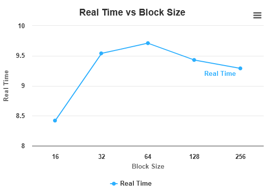
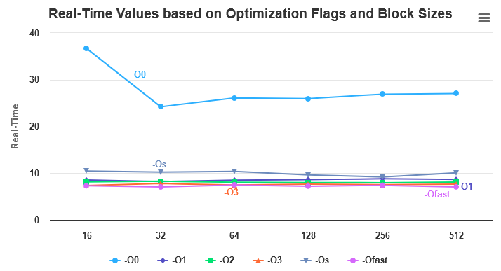

- The outer loops (ii, jj, kk) iterate over matrix indices in steps of BLOCK_SIZE, defining the current block of focus.
- BLOCK_SIZE is a predefined constant crucial for performance, determining the size of computation blocks.
- Inside these loops, three more loops handle matrix multiplication for the current block.
- Inner loops iterate over i, j, and k within the current block boundaries (ii, jj, kk) to (ii + BLOCK_SIZE, jj + BLOCK_SIZE, kk + BLOCK_SIZE).
- The innermost loop calculates matrix multiplication by iterating over k, performing row-column dot products.
- Resulting sums are accumulated into matrix C after each innermost loop iteration.

No loop tiling time ``20.95s``

Results of tiling with different size of block size:
```
block_size,real_time
16,8.42
32,9.54
64,9.71
128,9.43
256,9.29
```



With the different optimization flags:
```
opt_flag,block_size,real_time
-O0,16,8.48
-O1,16,2.58
-O2,16,2.45
-O3,16,2.09
-Os,16,2.83
-Ofast,16,2.06
-O0,32,9.44
-O1,32,3.00
-O2,32,2.80
-O3,32,2.58
-Os,32,3.60
-Ofast,32,2.57
-O0,64,9.74
-O1,64,2.85
-O2,64,2.66
-O3,64,2.42
-Os,64,3.58
-Ofast,64,2.35
-O0,128,9.09
-O1,128,2.70
-O2,128,2.55
-O3,128,2.31
-Os,128,3.53
-Ofast,128,2.37
-O0,256,9.17
-O1,256,2.59
-O2,256,2.60
-O3,256,2.37
-Os,256,3.42
```

