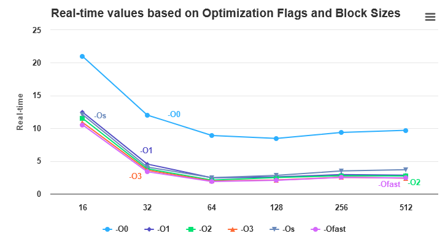

## Exercise 1
- The outer loops (ii, jj, kk) iterate over matrix indices in steps of BLOCK_SIZE, defining the current block of focus.
- BLOCK_SIZE is a predefined constant crucial for performance, determining the size of computation blocks.
- Inside these loops, three more loops handle matrix multiplication for the current block.
- Inner loops iterate over i, j, and k within the current block boundaries (ii, jj, kk) to (ii + BLOCK_SIZE, jj + BLOCK_SIZE, kk + BLOCK_SIZE).
- The innermost loop calculates matrix multiplication by iterating over k, performing row-column dot products.
- Resulting sums are accumulated into matrix C after each innermost loop iteration.

No loop tiling time ``20.95s``

Results of tiling with different size of block size when just using NO optimization flag:
```
block_size,real_time
16,8.42
32,9.54
64,9.71
128,9.43
256,9.29
```
The block size should be typically inside the L1 or L2 cache size, which can reach at most 64KB for L1 and 256KB for L2, to maximize cache utilization. We can see that 256 is the best block size for this case.


With the different optimization flags:
```
opt_flag,block_size,real_time
opt_flag,block_size,real_time
-O0,16,20.97
-O1,16,12.46
-O2,16,11.51
-O3,16,10.88
-Os,16,12.08
-Ofast,16,10.52
-O0,32,12.01
-O1,32,4.53
-O2,32,3.81
-O3,32,3.61
-Os,32,4.08
-Ofast,32,3.36
-O0,64,8.90
-O1,64,2.43
-O2,64,2.08
-O3,64,1.95
-Os,64,2.46
-Ofast,64,1.88
-O0,128,8.45
-O1,128,2.57
-O2,128,2.48
-O3,128,2.10
-Os,128,2.81
-Ofast,128,2.06
-O0,256,9.36
-O1,256,2.93
-O2,256,2.76
-O3,256,2.52
-Os,256,3.49
-Ofast,256,2.51
-O0,512,9.68
-O1,512,2.83
-O2,512,2.71
-O3,512,2.38
-Os,512,3.68
-Ofast,512,2.40
```



In general the best optimization flags are the higher ones, like O2, O3, Ofast. The best block size is 64 with the -Ofast flag. Note that the status "Verification: OK" is also being considerated. It means that if it is OK than the entry will be added into the table.

## Exercise 2

Measures access time for increasing memory block sizes.

1. Create a large array of characters (so it will be easier to working with KB) and fill it with random values.
2. Start with small block sizes and increase them gradually.
   For example, start with 1 KB, then 2 KB, 4 KB, 8 KB, and so on.
3. Measure the time it takes to access each block size.
4. Plot the results to visualize the relationship between block size and access time.

Probably we need also to add padding into the array to avoid cache line conflicts and try to acces each block only once. Also we need to disable optimizations to avoid compiler optimizations so we can get plain memory access time.
