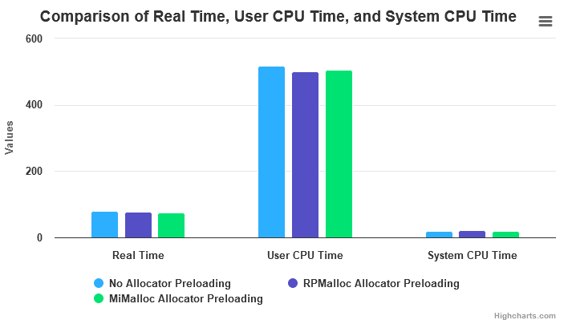
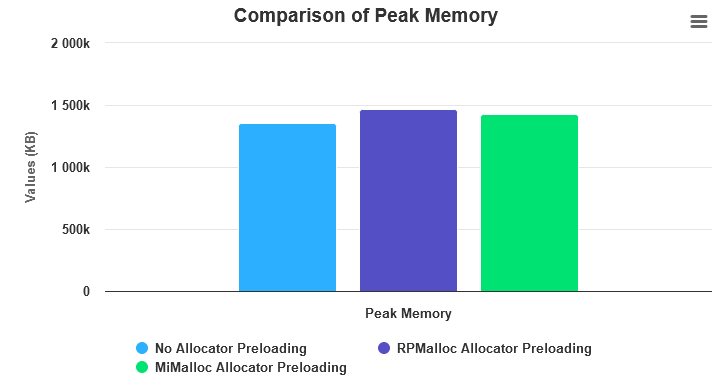
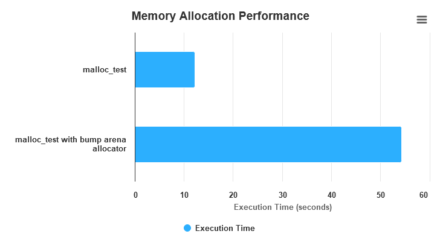

No Allocator Preloading

Real Time (s): 79.94
User CPU Time (s): 516.65
System CPU Time (s): 20.35
Peak Memory (KB): 1351912

RPMalloc Allocator Preloading

Real Time (s): 76.27
User CPU Time (s): 501.80
System CPU Time (s): 21.00
Peak Memory (KB): 1471296

MiMalloc Allocator Preloading

Real Time (s): 75.99
User CPU Time (s): 506.75
System CPU Time (s): 20.52
Peak Memory (KB): 1424476

* The real time for all benchmarks is within a similar range, with MiMalloc preloading showing slightly faster performance.
* MiMalloc shows slightly lower CPU usage than RPMalloc and no preloading.
* RPMalloc preload has the highest peak memory usage among the tested allocators.

