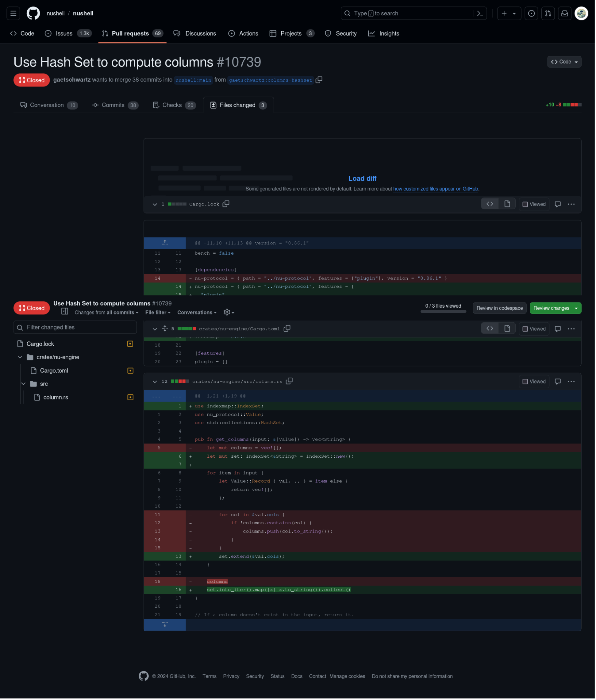
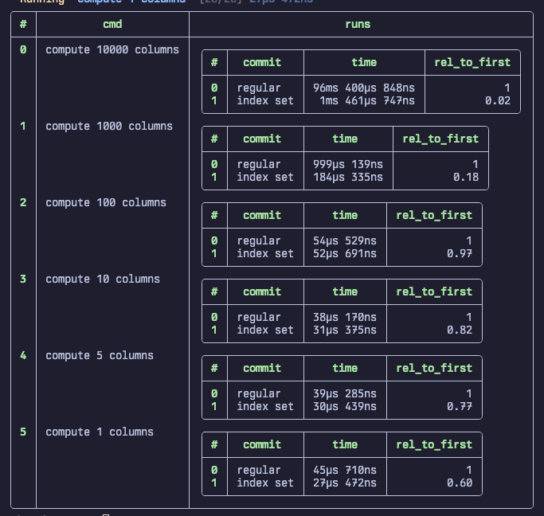

### Exercise 1
The pull request (PR) KhronosGroup/Vulkan-ValidationLayers#5587 addresses the problem of false sharing in multithreaded code, which can lead to performance degradation due to unnecessary cache coherence traffic between CPU cores. False sharing occurs when threads on different cores modify variables that reside on the same cache line, causing the cache line to be invalidated and reloaded frequently.

The issue involves variables that are shared between threads and may be updated frequently, leading to false sharing. Specifically, it looks like the code involves some shared counters or flags (ThreadSafety::thread_count) which multiple threads might access or update, potentially causing performance issues.

#### Solution
The PR reduces false sharing by:

- Aligning and Padding Variables:
    - Ensuring shared variables are on separate cache lines using alignment alignas => 64
    - Adding also padding to reader_count and writer_count variables. This padding increases the size of the class so that each variable occupies its own cache line. By doing this, the CPU will no longer invalidate the cache line when one of the variables is updated, improving performance.
- Ensuring proper memory barriers or atomic operations for thread safety.
- Adjustments in thread_safety.h, vk_layer_utils.cpp, and thread_safety_generator.py to align and pad shared variables.
- Removing redundant code contributing to false sharing.


### Exercise 2


link: https://github.com/nushell/nushell/pull/10739/files

The changes made in the pull request aim to improve performance by replacing a Vec (vector) with a HashSet.

In the get_columns():
- the `vec` has been replaced with a `HashSet` 
    - `HashSet` are fast for membership checks and do not contain duplicates
- Previous approach iterated through the input columns and added them to the columns vector if they weren't already present. 
    - This involved multiple membership checks, which are O(n) operations for vectors.
- New approach initializes a HashSet and directly extends it with the columns from each item in the input.
- Membership checks and insertions in a HashSet are average O(1) operations, making this approach significantly faster for large datasets.
- Thefore the nested loop is beeing deleted:
    ```rust
    for col in val.cols {
        if !columns.contains(col) {
            columns.push(col.to_string());
        }
    }
    ```
    and just replaced with one liner
    ```rust
    set.extend(&val.cols);
    ```
    since we have a set with unique keys we do not need to double check if the col is contained in the columns vec

- After processing all input items, the HashSet is converted back to a Vec for the final output:

```rust
columns = set.into_iter().map(|x| x.to_string()).collect();
```
- From O(N^2) to O(N)


For small numbers of columns (n), using a Vec with linear search can be faster due to lower overhead and better cache efficiency. However, as n increases, the benefits of using a HashSet