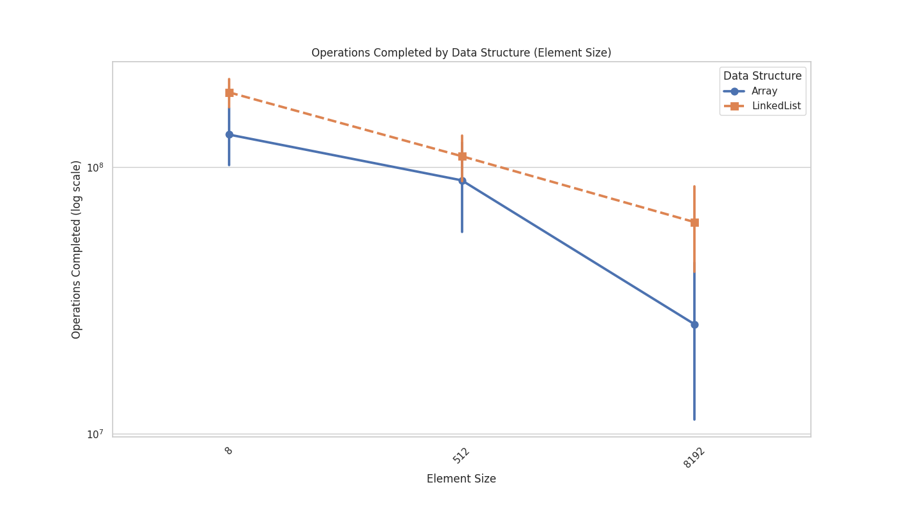
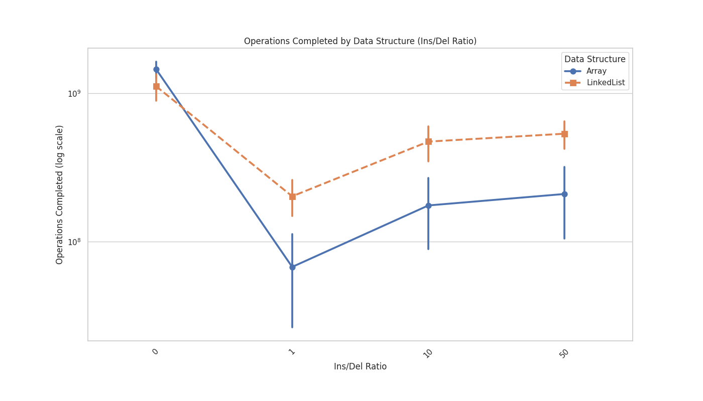
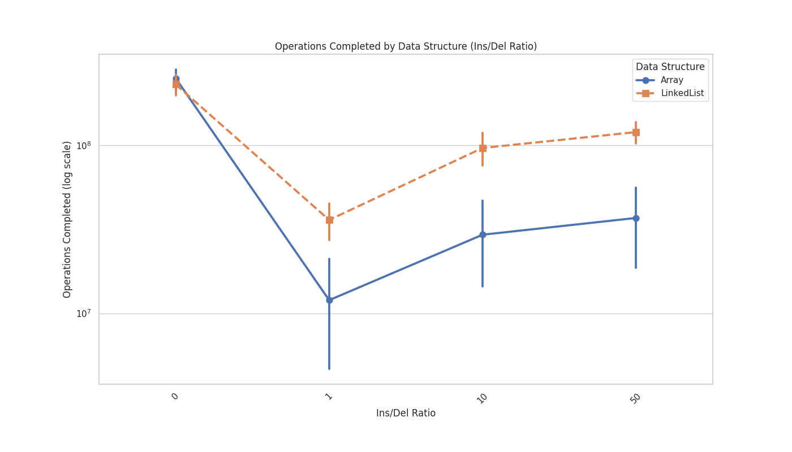
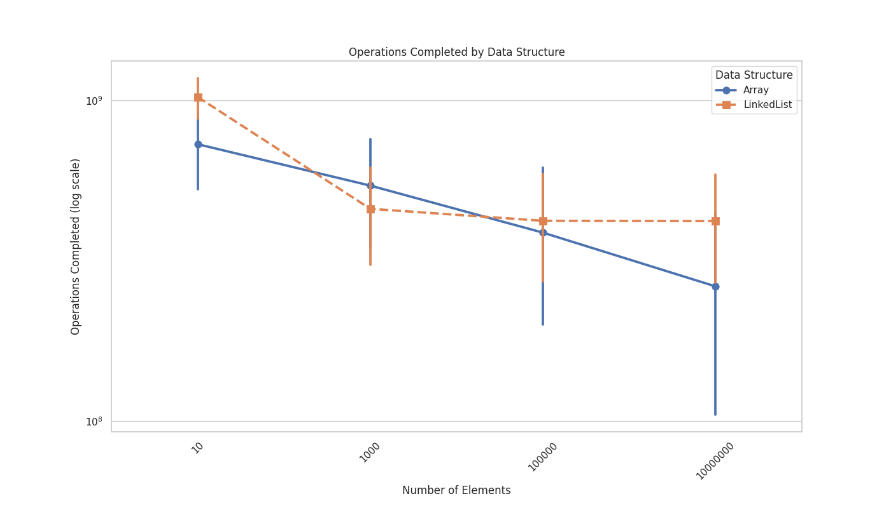
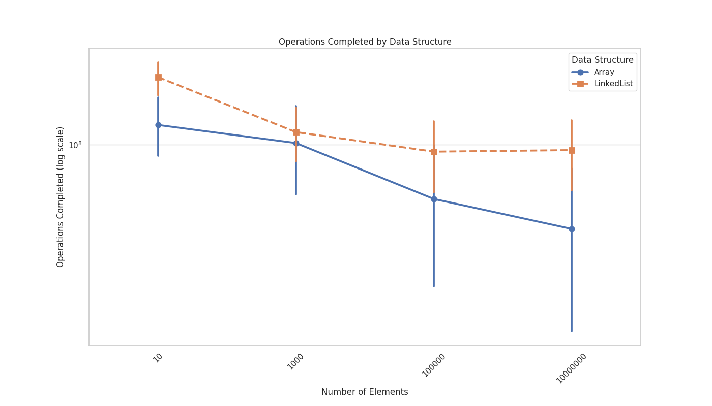

For benchmarking the timeout was set to 4 seconds for each iteration. The number of iterations was set to 384. This means that the maximum time for the benchmark is 1536 seconds = 25.6 minutes so we have no problem when running the benchmark on the lcc3, which could have problem when running >= 30 minutes.

2 * 4 * 4 * 3 * 4 = 384 Iterations * 4 seconds = 1536 seconds = 25.6 minutes
                  = 384 Iteartions * 5 seconds = 1920 seconds = 32 minutes >= 30 minutes

# Analysis
In general we can say that locally more operations are performed with the datastructure "Array" than with the datastructure "List". 
## Locally

## LCC3

## Elements size & Operations Completed
Arrays outperform linked lists when it comes to the number of operations completed, especially for larger element sizes. This is because arrays store data contiguously in memory, which allows for faster access and modification of elements. Linked lists, on the other hand, store data in separate nodes that are scattered throughout memory, which can lead to slower access times.
### Locally

### LCC3

### Insertion / Delete Ratio & Operations Completed
When the ratio of insertions and deletions is 0%, indicating only read and write operations are performed, arrays outperform linked lists due to their O(1) time complexity for these operations.
Conversely, when the ratio is 50%, linked lists outperform arrays because linked lists have O(1) time complexity for insertion and deletion, while arrays have O(n) due to potential shifting of elements.
### Locally

### LCC3

### Number of elements & Operations Completed
For a small number of elements, arrays are slightly better than linked lists due to their contiguous memory storage. However, as the number of elements increases, arrays become much more efficient compared to linked lists, as accessing elements in arrays is O(1) time complexity, whereas in linked lists, it's O(n).
When the number of elements is extremely large, the performance difference between arrays and linked lists narrows, as the overhead of traversing a large array can offset the benefits of its contiguous memory storage.
### Locally

### LCC3

### Read / Write Ratio & Operations Completed
Arrays significantly outperform linked lists in terms of read/write operations due to their O(1) time complexity for these operations. Linked lists, on the other hand, have O(n) time complexity for both read and write operations since they require traversing the list to access or modify elements.
### Locally

### LCC3

