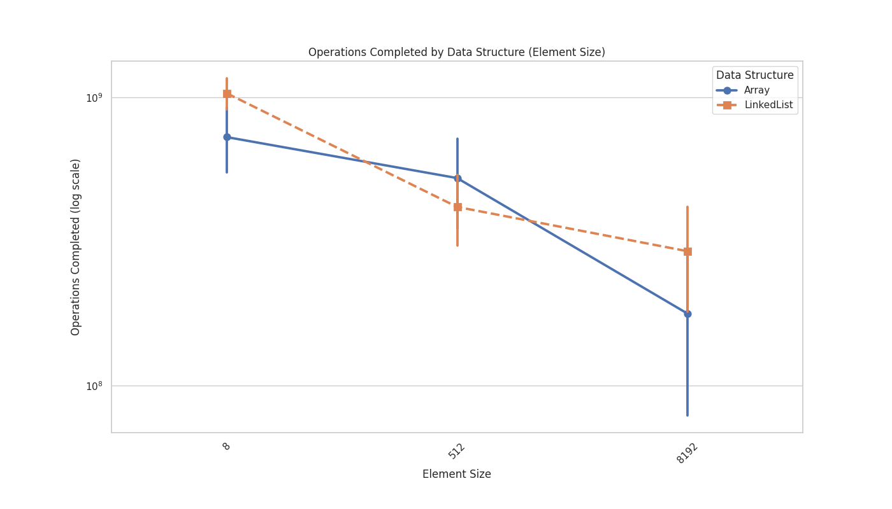
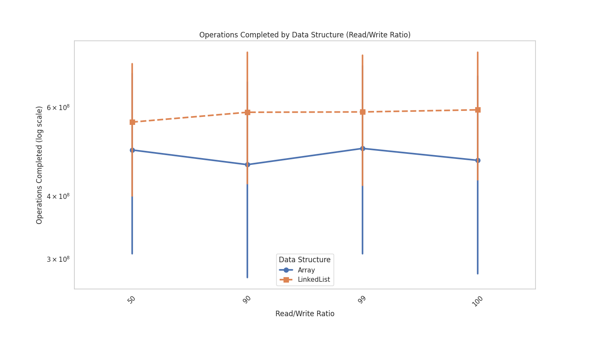
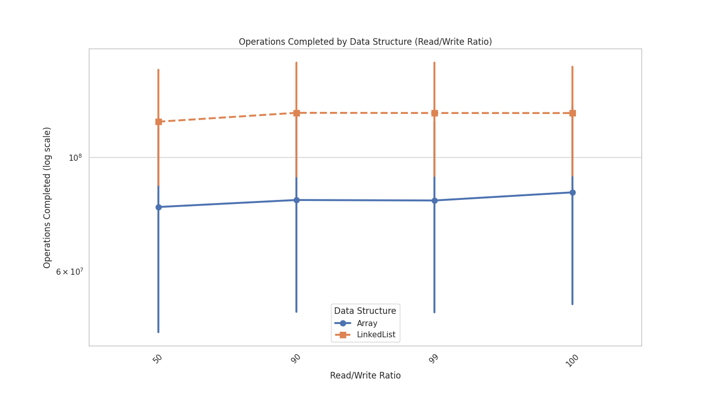

For benchmarking the timeout was set to 4 seconds for each iteration. The number of iterations was set to 384. This means that the maximum time for the benchmark is 1536 seconds = 25.6 minutes so we have no problem when running the benchmark on the lcc3, which could have problem when running >= 30 minutes.

2 * 4 * 4 * 3 * 4 = 384 Iterations * 4 seconds = 1536 seconds = 25.6 minutes
                  = 384 Iteartions * 5 seconds = 1920 seconds = 32 minutes >= 30 minutes
# Analysis
In general we can say that more operations are performed with the datastructure "LinkedList" than with the datastructure "Array". 
## Locally

## LCC3

## Elements size & Operations Completed
On lcc3 Linked Lists where with the element size 8 Bytes, 512 Bytes and 8192 Bytes always faster than Arrays. Accessing elements in arrays is O(1) time complexity, whereas in linked lists, it's O(n). For large element sizes the overhead of shifting elements in arrays can offset the benefits of its contiguous memory storage, since we have to shift large amounts of data. Meanwhile linked lists have O(1) time complexity for insertion and deletion since it just needs to change the pointers of the elements.
### Locally

### LCC3

### Insertion / Delete Ratio & Operations Completed
0% Ins/Del (100% Read/Write):
With no insertions or deletions, the operations are primarily reads. Arrays excel in read operations due to their O(1) access time, leading to high performance.
LinkedList: While read operations are O(n) in LinkedLists, the difference is less pronounced when no insertions or deletions occur, but Arrays still have a slight edge.

50% Ins/Del (50% Insert/Delete, 50% Read/Write):

Array: The performance degradation becomes very pronounced as insertions and deletions are as frequent as read and write operations. The O(n) complexity for insertions and deletions leads to a significant reduction in the number of operations completed.
LinkedList: LinkedLists excel in this scenario as they efficiently handle the frequent insertions and deletions with O(1) complexity. This results in a much higher number of operations completed compared to arrays, which struggle with the high overhead of shifting elements.
### Locally

### LCC3

### Number of elements & Operations Completed
For a small number of elements, linked list are slightly better than arrays. This goes on until 1000 Elements. After that linked lists are way better than arrays. We need also to consider the element size. Which in this case with 8 Bytes, 512 Bytes and 8192 Bytes. We saw that with greater element sizes linked lists are faster than arrays and element size correlates with the number of elements. 
### Locally

### LCC3

### Read / Write Ratio & Operations Completed
I was expecting that arrays and linkedlists would be more similar for read/write. Linked lists are for every read/write ratio faster than arrays. This is because linked lists have O(n) time complexity for read operations, but O(1) time complexity for write operations. Arrays have O(1) time complexity for read operations, but O(n) time complexity for write operations. 

For 100% read/write operations and 0% ins/del operations,  arrays should be in theory faster than linked lists but probably the the big size of the elements and the number of elements are the reason why linked lists are faster than arrays.
### Locally

### LCC3

